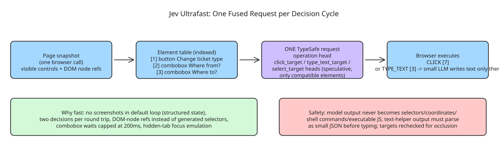

# Jev Ultrafast (browser-use) — A Browser Agent with a Dynamic, Indexed Action Space

**Jev Ultrafast** ([browser-use/jev-ultrafast](https://github.com/browser-use/jev-ultrafast), MIT) is a browser agent built on [TypeSafe's Jev](https://docs.typesafe.ai/introduction): give it one goal, and each decision cycle picks **an operation and an element index from the current page** — with a small LLM writing text only when the chosen operation is `TYPE_TEXT`. Headline result: Zürich → London on Google Flights in **7.1 seconds**, including actual text generation and loading waits.

## The action space design

Every observation produces a fresh numbered element table:

```
[1] button    Change ticket type · Round trip
[2] combobox  Where from?        · San Francisco
[3] combobox  Where to?          · empty
[4] textbox   Departure          · empty
...
```

Operations are `CLICK`, `TYPE_TEXT`, `SELECT`, `SCROLL_UP`, `SCROLL_DOWN`, `WAIT`, `DONE`, `BLOCKED` — and **only supported operations and targets for the current state are offered** (a dynamic, indexed action space rather than a fixed tool list). The key efficiency: operation and target heads are **speculative but share one TypeSafe request** — if the operation is `CLICK`, only `click_target` can execute. Two decisions in **one network round trip**. Each target head contains only compatible elements; native dropdown choices carry an observed element/option index.

```
page → element table → [operation | click_target | type_text_target | select_target]
                              │ use the matching target
              CLICK [7] ──────┤──→ browser
              TYPE_TEXT [3] ──┘
                                ↓
                     small LLM → text → browser
```

There are **no site-specific action scripts or prepared field strings** in the policy — the Flights example supplies a goal and independently verifies the outcome. The screenshot renderer adds labels afterward; it does not drive the browser.

## Why it moves fast (the engineering details)

- **One request per decision cycle**: operation + target heads share observed state.
- **No screenshots in the default loop** — Jev consumes structured state; the inspector opts into screenshots, and demo videos use a separate continuous screencast.
- **One browser call per snapshot**: visible controls' names/values/text read atomically, keeping references to actual DOM nodes (not selectors).
- **Validate the selected target before acting**: clicks recheck document freshness, form values, target, nearby context; covered/occluded controls are rejected before input; animation alone doesn't force another prediction.
- **Wait for useful state**: after typing into a combobox, wait for visible suggestions (capped at 200 ms); other interactions get ≤ two animation frames or 50 ms — reads happen *after* execution is logged.
- **Keep hidden tabs rendering** via focus emulation (prevents background animation throttling without switching the visible tab).
- **Send only visible text**: offscreen article bodies/footers don't fill model context.
- **Reuse interrupted text requests**: a generated value survives a stale-page retry only if the entire text-helper input is unchanged.

Safety property: every executed target resolves from an observed node, and **model output never becomes selectors, coordinates, shell commands, or executable JavaScript** — text-helper output must parse as a small JSON object before typing.

## Running it

```shell
git clone https://github.com/browser-use/jev-ultrafast.git
cd jev-ultrafast
uv sync
cp .env.example .env   # add TYPESAFE_API_KEY and TEXT_MODEL_API_KEY
uv run jev             # open http://127.0.0.1:8766 → Start demo → Run automatically
```

Chrome connects through [Browser Harness](https://github.com/browser-use/browser-harness) (installed by `uv sync`; `uv run browser-harness --doctor` if needed). The text helper is an OpenRouter key in the example config (`inception/mercury-2.5`, reasoning disabled); Gemini/GLM/DeepSeek work via any OpenAI-compatible endpoint.

As a library:

```python
from jev_ultrafast import Agent

with Agent(
    "https://www.google.com/travel/flights?hl=en",
    "Find one-way flights from Zurich to London on September 20, 2026, "
    "for one adult in economy. Stop when matching flight options are visible.",
) as agent:
    for state in agent.run():
        print(state["elapsed_ms"], state["status"])
```

The same policy runs different tasks (`examples/run.py --url ... --goal ...`); `examples/flights.py --keep-open` performs the search, checks the actual route/date/results, and saves its trace — it does not select or book a flight. Tests are offline; `uv run python scripts/check_guards.py` exercises real controls in a local browser without model calls.

## Why this matters for agent architecture

The design is a concrete answer to "how do you keep a web agent fast *and* safe": structured state instead of screenshots (cheaper context, no vision latency), one fused operation+target request per cycle (halving round trips), DOM-node references instead of generated selectors (no selector-rot), and hard separation between model output and executable actions. The whole loop is small enough to read in `jev_ultrafast/agent.py`.

## Diagram



## References

- [browser-use/jev-ultrafast on GitHub](https://github.com/browser-use/jev-ultrafast)
- [TypeSafe Jev documentation](https://docs.typesafe.ai/introduction)
- [Browser Harness (Chrome connection layer)](https://github.com/browser-use/browser-harness)
- [Performance measurements](https://github.com/browser-use/jev-ultrafast/blob/main/docs/performance.md)
