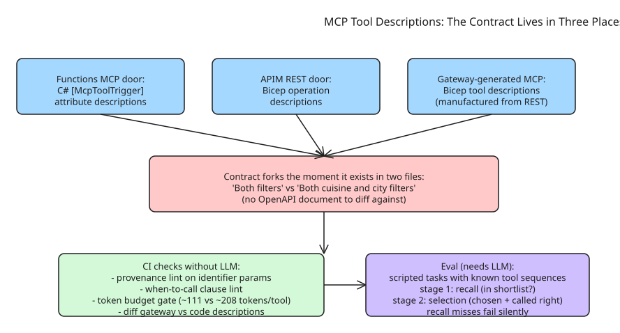

# Tool Descriptions Are the Contract — Treating MCP Prose as a Load-Bearing API Interface

In an MCP server, **prose is load-bearing**: the description decides whether the agent picks your tool, the parameter text decides whether it calls it correctly, and the error message decides whether it recovers. That prose *is* the API contract now — yet almost nobody treats it like one (no review process, no budget, no tests). This note distills the argument from a dev.to series comparing MCP and REST as "two doors into the same kitchen."

## The contract already lives in three places

In the author's sample repo ([mcp-vs-api-azure-functions](https://github.com/steefjan1/mcp-vs-api-azure-functions)), one restaurant backend describes its behavior in prose **three times**:

```csharp
// Door 1: Functions MCP — C# attribute
[McpToolTrigger("search_restaurants",
    "Searches the restaurant directory. Both filters are optional; call it without arguments to list every restaurant.")]
```

```bicep
// Door 2 & 3: APIM REST operation + gateway-generated MCP — Bicep
description: 'Searches the restaurant directory. Both cuisine and city filters are optional; call without arguments to list every restaurant.'
```

Written two days apart by one person, the copies already drifted ("Both filters" → "Both cuisine and city filters"). The REST door survives prose drift because its real contract lives elsewhere — routes, status codes, an **OpenAPI document that tooling can diff**. MCP doors have no "elsewhere": *the description is the interface*. Scale the sample to fifty tools, three teams, a year of changes, and the gateway's MCP door describes a backend that no longer behaves as its C# door claims.

## What a good description buys (at a known price)

A realistic description costs ~**111 tokens per tool**, a verbose one ~208 — paid on *every* model call. Three rules earn their tokens differently:

1. **Say what the tool does**, in one sentence that distinguishes it from its neighbors.
2. **Say when to call it** — mostly about optionality ("both filters are optional; call without arguments…") so the agent doesn't invent a filter just to have one.
3. **Say where values come from**: "the restaurant id, as returned by `search_restaurants` (for example 'r1')". A JSON schema can say `restaurantId: required string`; only prose says *this string must come from a previous call and must not be guessed*. **Provenance is the highest-value sentence in the contract** — it's the difference between an agent that chains tools and one that hallucinates identifiers.

The verbose tier mostly doubles the bill with ceremony the model would infer anyway: spend on disambiguation and provenance, cut the rest.

## Door parity is about decisions, not formats

Auth and idempotency live in the shared service both doors call, so neither door can drift on what's allowed or what a retry does. Error rendering is where the doors deliberately differ — same fact, two renderings:

```csharp
// REST door: machine-shaped (4xx + small JSON body) for code callers
// MCP door: instructions for agent callers
return menu is null
    ? $"Restaurant '{restaurantId}' was not found. Use search_restaurants first to get a valid id."
    : JsonSerializer.Serialize(menu, JsonOptions);
```

Parity means the doors agree on the *decision* (the kitchen says "invalid order"), not that they speak the same dialect — each door reports it in the shape its caller can act on.

## Error strings are confusion telemetry

Recovery sentences do a second job: they're **constants**, so every time one is returned you know exactly which misunderstanding just happened. `"Use search_restaurants first to get a valid id"` fires when an agent invented an ID — meaning the provenance sentence in `get_menu`'s description didn't land. Add one log line where each recovery string is returned and your APM (e.g., Application Insights) becomes a **description quality dashboard**: group by sentinel string, per tool, per client. A rising count on one string isn't an outage — it's a failing sentence in your contract, located precisely. The author calls this the cheapest contract test available: instrumenting errors you already wrote.

## Validating the contract without (and with) an LLM

**CI checks that need no LLM:**
- Lint every identifier parameter for a provenance statement.
- Lint every tool description for a when-to-call clause.
- **Token-budget gate**: run the measurement harness against your tools array in CI so "our context bill crept up" becomes a failing build with a number in it.
- **Drift diff**: if gateway Bicep descriptions and code attribute descriptions are both machine-readable, a test can diff them.

**What CI cannot check:** whether the model actually picks the right tool. That needs scripted tasks with known-correct tool sequences run repeatedly against description variants, scored as a two-stage system:
- **Stage 1 — recall**: did the correct tool make it into the shortlist (deferred loading/retrieval)? A miss is a retrieval or granularity problem and *fails silently* — a cheap context with the right tool absent is the worst outcome, because the model improvises something plausible instead of erroring.
- **Stage 2 — selection**: did the model choose it from the shortlist and call it correctly? A miss is a description problem.

## Verdict

Treat descriptions like interfaces: one authoritative copy you can manage, review on every change, token budget enforced in CI, provenance sentences on every identifier, telemetry on error strings that reveal where the contract fails. "The doors were never the hard part. The words were."

## Diagram



## Related notes

- [How to Map HTTP API Path, Query, Header, and Body Parameters into MCP Tool Schemas](../../../how-to/developertoolspractices/mcp/howto-map-http-api-parameters-to-mcp-tool-schemas.md) (howto) — the schema side of this contract.

## References

- [Tool Descriptions Are the Contract (dev.to)](https://dev.to/steefjan_wiggers_34a415b/tool-descriptions-are-the-contract-5488)
- [Sample repo: mcp-vs-api-azure-functions](https://github.com/steefjan1/mcp-vs-api-azure-functions)
