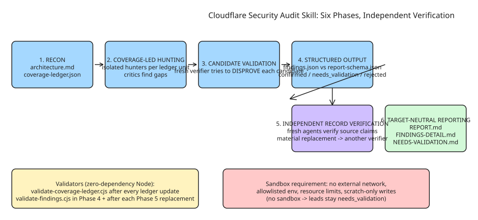

# Cloudflare's Security Audit Skill — Multi-Phase Agent Audits with Independently Verified Findings

Cloudflare open-sourced ([MIT](https://github.com/cloudflare/security-audit-skill)) the **security-audit skill** that seeded their internal vulnerability discovery harness (described in [Build your own vulnerability harness](https://blog.cloudflare.com/build-your-own-vulnerability-harness)). It turns a coding agent into a security auditor by orchestrating *isolated* sub-agents through six phases, with machine-readable findings validated against a JSON schema. The key design bet: **the agent that checks a finding is never the agent that found it**.

## The six-phase pipeline

1. **Reconnaissance** — map architecture, trust boundaries, input surfaces, prior evidence, and deterministic coverage into `architecture.md` + `coverage-ledger.json`.
2. **Coverage-led hunting** — assign isolated hunters from ledger units; record their checks; use *coverage critics* to find gaps (hunting is driven by what's uncovered, not vibes).
3. **Candidate validation** — every unique candidate goes to a **fresh verifier that tries to disprove it**.
4. **Structured output** — write `confirmed` / `needs_validation` / `rejected` records to `findings.json`, validated against `report-schema.json`.
5. **Independent record verification** — fresh agents verify final source claims; material replacements get *another* independent verifier.
6. **Target-neutral reporting** — derive `REPORT.md`, `FINDINGS-DETAIL.md`, `NEEDS-VALIDATION.md` from verified records + coverage ledger.

The parent agent runs `validate-coverage-ledger.cjs` after creating the ledger and after every later update, and `validate-findings.cjs` in Phase 4 and again after every Phase 5 replacement — both zero-dependency Node validators with their own test suites (`validate-findings.test.cjs`, `validate-coverage-ledger.test.cjs`).

## Verdict semantics (the part most agent-audit outputs get wrong)

| Verdict | Meaning |
| --- | --- |
| `confirmed` | Complete source trace **and** bounded observed result |
| `needs_validation` | Exact unresolved fact stated; **no severity assigned** |
| `rejected` | Candidate disproved, with the disproof recorded |

Severity requires *impact* (likelihood × impact), not deviation from a checklist. A source-grounded lead that's blocked stays `needs_validation` — never silently dropped or inflated. Defense-in-depth gaps are hardening notes, not vulnerabilities: if Layer A prevents the attack, missing Layer B is not a vuln.

## The hunting classes

The skill ships per-domain prompt files rather than one generic "find bugs" prompt: `ATTACK-CLASSES.md` (core/wildcard/obvious), plus specialized classes for memory-safety/binary/kernel (`MEMORY-SAFETY-AND-BINARY.md`), LLM-backed targets — prompt injection, agent/tool abuse, output handling (`AI-AND-LLM.md`), HTTP protocol/auth framing and cache attacks (`WEB-PROTOCOL-AND-AUTH.md`), client-side DOM/messaging/prototype pollution (`CLIENT-SIDE.md`), supply chain/CI/release/signing (`SUPPLY-CHAIN-AND-RELEASE.md`), cloud/IaC/serverless (`CLOUD-AND-DEPLOYMENT.md`), RPC/serialization/queues/webhooks (`PROTOCOLS-RPC-AND-MESSAGING.md`), resource exhaustion and operator-spend (`RESOURCE-EXHAUSTION-AND-AVAILABILITY.md`), tenant isolation/lifecycle (`DATA-ISOLATION-AND-LIFECYCLE.md`), and desktop/mobile/local IPC (`DESKTOP-MOBILE-AND-LOCAL-IPC.md`).

## Installation and usage

```shell
npx skills add https://github.com/cloudflare/security-audit-skill \
  --skill security-audit          # add --global for user-level install
```

Then point a coding agent at the codebase: `security audit this codebase`, `find security vulnerabilities in ./src`, or `do a security review, output to ~/audits/my-project`. Full audit mode defaults its output dir to `~/security-audit-skill/<repo-name>/run-<N>`; it only writes inside the target repo when you explicitly pick an ignored directory.

Requirements: a coding agent with tool use + parallel sub-agents, Node.js for the validators, and — critically — an **OS-enforced sandbox** for target-controlled builds/tests/processes/browsers/fuzzers: no external networking, sanitized allowlisted environment, resource limits, writes only to assigned scratch paths. Without those controls the workflow keeps leads as `needs_validation` instead of executing target code (i.e., it refuses to run untrusted code unsandboxed).

## Empirical note worth remembering

In their test runs, **a single audit found roughly half the vulnerabilities that repeated runs found in total**. Multiple runs are additive: prior ledgers and findings target gaps, revalidate changed source, and carry forward current-source evidence without treating stale or unresolved work as covered. If you run agent-based audits once per release and call it done, expect to miss about half of what's findable.

## Diagram



## Related notes

- [Hardening MCP: A Threat Model and Checklist](../../../how-to/securityprivacy/aiagentsecurity/howto-mcp-security-hardening.md) (howto) — the other side of agent security: protecting *your* tools from agents.
- [The Miasma Worm: How AI Coding Agents Became a Supply Chain Attack Surface](explanation-miasma-worm-agentic-supply-chain-attack.md) (explanation).

## References

- [cloudflare/security-audit-skill on GitHub](https://github.com/cloudflare/security-audit-skill)
- [Cloudflare blog: Build your own vulnerability harness](https://blog.cloudflare.com/build-your-own-vulnerability-harness)
- [Skills CLI (skills.sh)](https://skills.sh/)
