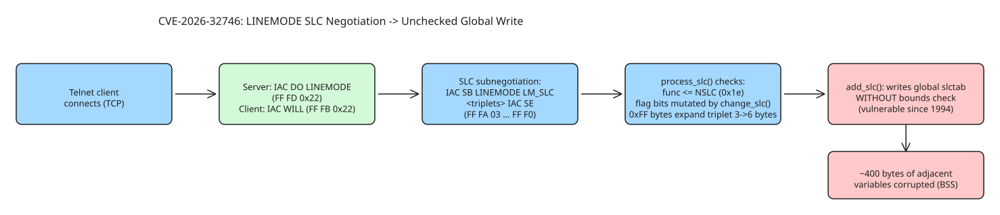

# GNU inetutils Telnetd CVE-2026-32746 — A 32-Year-Old LINEMODE SLC Buffer Overflow

CVE-2026-32746 (discovered by the DREAM Security Research Team, analyzed by watchTowr Labs) is a **pre-authentication BSS-based buffer overflow** in GNU inetutils `telnetd`, introduced in **1994** and only patched in 2026. It lives in the **LINEMODE SLC (Set Linemode Characters)** negotiation handler: the server stores client-supplied three-byte triplets into a global fixed-size array (`slcbuf`, sized `0x6C` bytes) **without any bounds check**, allowing corruption of roughly 400 bytes of adjacent variables. Because most vendors based their telnetd on the same code, the blast radius spans Ubuntu, Debian, FreeBSD 13/15, NetBSD 10.1, Citrix NetScaler, Apple Mac Tahoe, Haiku, TrueNAS Core, uCLinux, libmtev (Circonus), and DragonFlyBSD.

## Why Telnet still matters in 2026

Telnet is not just "a TCP stream to a shell" — it negotiates terminal control, window size, authentication, and encryption features via **in-band signaling** using the `IAC` byte (`0xFF`). More features means more attack surface (cf. CVE-2026-24061, an environment-variable-sharing RCE). Legacy equipment (CNC machines on 8-bit microcontrollers, network appliances) still runs telnetd because migration is impossible or too costly — which is exactly why a pre-auth hole in it matters.

## The negotiation path to the vulnerable code

```
[SERVER] -> IAC DO LINEMODE        (0xFF 0xFD 0x22)
[CLIENT] -> IAC WILL LINEMODE      (0xFF 0xFB 0x22)
[CLIENT] -> IAC SB LINEMODE LM_SLC <triplets> IAC SE   (0xFF 0xFA 0x03 ... 0xFF 0xF0)
```

Each triplet is `(func, flag, val)` — one byte each. The server's `process_slc()` applies constraints:

- `func > NSLC` (`0x1e`) → remaining bytes zeroed to `SLC_NOSUPPORT`, but the first byte still lands in the global array via `add_slc()`.
- `func == 0` with `SLC_DEFAULT`/`SLC_VARIABLE` flags → handled specially, triplet does not reach the buffer.
- `change_slc()` mutates the flag byte: if its bottom two bits are zero (`SLC_NOSUPPORT`), `SLC_ACK` (`0x80`) is OR'd in.
- **Any byte equal to `0xFF` is doubled** when written — a triplet can expand from 3 bytes to 4, 5, or 6:

| 0xFF In | Triplet size | Bytes written | Alignment shift |
| --- | --- | --- | --- |
| None | 3 | `[F, flag, V]` | +0 |
| func | 4 | `[0xFF, 0xFF, flag, V]` | +1 |
| val | 4 | `[F, flag, 0xFF, 0xFF]` | +1 |
| func + val | 5 | `[0xFF, 0xFF, flag, 0xFF, 0xFF]` | +2 |

The doubling prevents writing odd runs of `0xFF` (you cannot represent `0x11 0xFF 0x22`, only `0x11 0xFF 0xFF 0x22`) — a major hurdle on 64-bit x86 where pointers contain repeating `0xFF` bytes. But it also gives an **alignment tool**: padding with `0xFF` shifts which byte lands at which offset, enabling e.g. aligning the `val` byte onto the least-significant byte of a pointer for a partial overwrite on little-endian targets.

## Exploitation reality: "Pandora's box"

The whole payload must fit in one subnegotiation packet (`0x200` bytes); with 4 header bytes, that caps the usable overflow at `0x190` bytes past `slcbuf`. Beyond that, everything is **binary-specific** — compiler global layout differs per build. watchTowr found no direct RCE route on any system they tested; 64-bit x86 was hardest (full pointer overwrites need consecutive NULL bytes the constraints forbid).

The most interesting case: **32-bit Debian bookworm**. There, `slcbuf` sits next to `slcptr`, a length variable, and — crucially — `def_slcbuf`. When SLC data arrives before terminal init (`terminit()` false), `do_opt_slc()` defers processing by copying the packet into a freshly `malloc`'d `def_slcbuf`; later `deferslc()` processes it and calls **`free(def_slcbuf)`**. Since the attacker controls the contents of that buffer (including its pointer value after overflow), this yields an **arbitrary free primitive** — plus a heap pointer leak via crafted responses. On embedded systems with naive heaps, arbitrary free → RCE is short; on modern glibc it requires serious work.

Triggering the defer path: respond to `LINEMODE` before `TTYPE`:

```
[SERVER] <- IAC DO TTYPE / IAC DO LINEMODE
[CLIENT] -> IAC WILL LINEMODE / IAC WILL TTYPE
[CLIENT] -> IAC SB LINEMODE (...) IAC SE   (saved into def_slcbuf)
[CLIENT] -> IAC SB TTYPE (...) IAC SE      (terminit=1, do_opt_slc(def_slcbuf), then free)
```

## Patching and detection — the awkward parts

- The patch is a minimalist bounds check: data that would overrun `slcbuf` is **silently ignored** (no error message, no connection drop).
- **No fixed release exists**: inetutils 2.7 (latest download) is still vulnerable; you must build from git at or after commit `6864598a`. Most distros have not shipped packages; only Debian sid/forky carries a fix — every other Debian release remains vulnerable.
- **Detection** exploits the silent-ignore behavior: fill the buffer with junk, then send an unusual value past the boundary. A vulnerable server stores and echoes it back in its own SLC response; a patched server drops it. watchTowr publishes a [detection artifact generator](https://github.com/watchtowrlabs/watchtowr-vs-telnetd-CVE-2026-32746) engineered to overflow by exactly one byte (with the caveat that on a vulnerable target even that could segfault).
- The same bug existed **client-side** in 2005 as [CVE-2005-0469](https://nvd.nist.gov/vuln/detail/CVE-2005-0469) (`slc_add_reply` missing the identical bounds check) — history rhyming.

## Takeaways for defenders

1. **Patch immediately** if you run any telnetd, especially on systems where downtime cost is what kept you unpatched in the first place.
2. Since no distro packages exist yet, track the upstream git commit and build from source; treat "maintainers haven't released a fix" as *more* urgent, not less.
3. Inventory telnetd exposure across forks (NetScaler, TrueNAS, Haiku, embedded) — scanners keyed to inetutils versions will miss them.
4. Exploitability is per-build: assume targeted attackers can tailor exploits for popular products; the long tail of odd builds is your protection only by obscurity.

## Diagram



## References

- [watchTowr Labs: A 32-Year-Old Bug Walks Into a Telnet Server (CVE-2026-32746)](https://labs.watchtowr.com/a-32-year-old-bug-walks-into-a-telnet-server-gnu-inetutils-telnetd-cve-2026-32746/)
- [inetutils patch (codeberg PR #17)](https://codeberg.org/inetutils/inetutils/pulls/17/files)
- [Fixed commit 6864598a](https://codeberg.org/inetutils/inetutils/commit/6864598a29b652a6b69a958f5cd1318aa2b258af)
- [Detection artifact generator (watchtowrlabs)](https://github.com/watchtowrlabs/watchtowr-vs-telnetd-CVE-2026-32746)
- [RFC 1184 — Telnet Linemode Option](https://datatracker.ietf.org/doc/html/rfc1184)
- [CVE-2005-0469 (client-side doppelganger)](https://nvd.nist.gov/vuln/detail/CVE-2005-0469)
