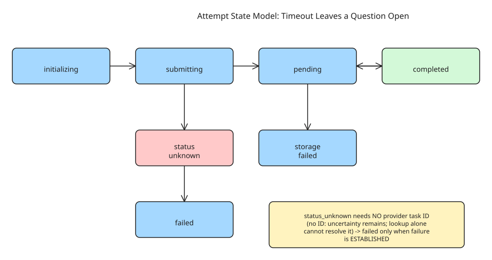

# Handling Timeouts in AI Image Generation Without Blind Retries — Modeling Uncertainty as a State

When your backend submits an image-generation request and the HTTP call times out, **the provider may already be creating the image**. Submitting again creates a second paid task. The core insight of this article: a timeout leaves a *question open* that blind retries answer by paying twice. A documented rejection establishes "not accepted"; a lost response cannot — the request might never have arrived, or the provider might have accepted it before the response was lost.

## Two costs to keep separate

1. **Upstream charge**: creating another provider task incurs another bill.
2. **Local accounting error**: deducting user credits twice is a *separate* bug. A local credit reservation does not prevent duplicate provider tasks, and provider-side deduplication does not make your local ledger idempotent.

## Keep local and provider identity separate

- A **local request ID** identifies one intended generation; the **provider task ID** identifies work accepted upstream. Persist their association when a submission response arrives.
- A request ID alone is *not* idempotency: reusing it must lead to the **stored attempt**, not another submission — and the service must check ownership plus input consistency (reusing an ID for different input must not silently return an unrelated result).
- Submission uses persisted state + a lease to coordinate competing requests. The client must retain the ID across recovery; generating a fresh ID per retry defeats local deduplication.

## Model what is known

A useful state model separates uncertainty from confirmed failure, and generation from delivery:

```
type AttemptState =
  | 'initializing'
  | 'submitting'
  | 'pending'
  | 'status_unknown'
  | 'storage_failed'
  | 'completed'
  | 'failed';
```

- `status_unknown` needs **no provider task ID** — it covers both a submission whose response was lost before an ID could be recorded, and an accepted task whose current result cannot be established. It can resolve to `pending`/`completed`/`storage_failed` once an identified task can be checked; it reaches `failed` **only when failure is established**.
- `storage_failed` means the image may have generated fine while saving/delivery failed — recover *delivery* of the existing task, don't generate another image.

```
initializing -> submitting -> pending -> completed
                    |           |
                    |           +-> storage_failed -> completed (retry delivery)
                    v
               status_unknown
                    +-> pending / completed / storage_failed (when a task can be checked)
                    +-> failed only when failure is established
```

## Keep the reservation until there is a settlement decision

Reserve credits before submission and persist enough to connect the reservation to the attempt. After acceptance, retain it while pending; after an ambiguous submission, retain it while unknown — neither a missing task ID nor a failed status query establishes that generation failed. Settlement policy:

- Confirmed, available delivery → settle the reservation (once).
- Confirmed failure → release it (once).
- Unknown status or recoverable storage failure → keep it reserved.

That leaves unresolved work for an operator to handle with a documented reconciliation/compensation/expiry policy — and any such decision should record its reason *separately* from the provider outcome, because returning credits as compensation does not prove the provider never did the work.

## Recovery depends on whether you have a task ID

- **With a provider task ID**: query it. Still processing → preserve attempt + reservation. Status query fails → preserve uncertainty. Generation succeeded → retrieve and save the result *before* treating it as delivered (an upstream success response is not enough when the image is still unavailable to the user).
- **Without one**: replaying the same local request returns the existing attempt rather than creating another provider task. Some providers offer lookup by caller-supplied reference or idempotent submission — confirm those capabilities (including retention and request-matching rules) for your specific API; a local request ID is not automatically an upstream idempotency key.
- **No recovery mechanism**: keep the distinction visible — the outcome is *unresolved*. A separately requested new generation may incur another charge and must not be disguised as a harmless retry of the original task.

## Separate delivery recovery from generation

Delivery failures (storage, asset availability) are retried against the existing task; only confirmed absence of work justifies a new submission. This mirrors the broader durable-execution principle that **definition-level failure** (the step is not idempotent / cannot be re-run safely) differs from **execution-level failure** (this run failed and can be retried).

## Diagram



## Related notes

- How to Choose Restart vs Resume Recovery Strategy — the restart/resume decision procedure this pattern feeds into.
- How to Implement a Saga State Machine at Application Level — persisted per-step state + trigger, the same shape as the attempt model above.

## References

- [Handling Timeouts in AI Image Generation Without Blind Retries (dev.to)](https://dev.to/zhengguge06/handling-timeouts-in-ai-image-generation-without-blind-retries-4dc4)
