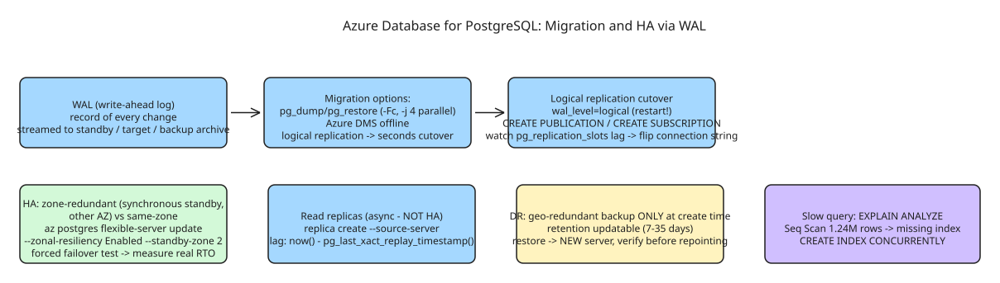

# How to Configure and Migrate to Azure Database for PostgreSQL (WAL-Based Migration, HA, PITR)

Migrating a database and keeping it highly available afterward are the **same discipline at two moments** — both run on one mechanism: PostgreSQL's **write-ahead log (WAL)**, streamed to wherever changes need to go: a standby replica (HA), a target server (migration), or a backup archive (DR). Three terms frame everything below:

- **WAL** — before changing a data page, PostgreSQL writes the change record to the WAL. This is what makes crash recovery possible (replay since last checkpoint) and replication possible (stream + replay elsewhere).
- **RTO vs RPO** — RTO = how long you're down; RPO = how much data you can lose. A synchronous HA replica targets near-zero RPO; an hourly backup a much larger one. The HA configuration choice is really an RPO decision in disguise.
- **Logical vs physical replication** — physical (WAL streaming default) copies byte-for-byte: fast, but the replica must be the same PostgreSQL version and can't be selective. Logical replicates row-level changes for specific tables: slower, but works across versions — which is what makes near-zero-downtime migration possible.

## Step 1 — Pick the migration tool by the downtime you can afford

| Method | Downtime | Best for |
| --- | --- | --- |
| `pg_dump` / `pg_restore` | Minutes–hours (∝ DB size) | Small databases, maintenance window OK |
| Azure Database Migration Service (offline) | Similar to pg_dump, managed | Medium databases, want a managed job |
| Logical replication (online) | Seconds (final cutover only) | Production, extended downtime unacceptable |

### 1.1 The simple path: `pg_dump` / `pg_restore`

```bash
pg_dump -h source-server.postgres.database.azure.com \
  -U dbadmin -d production_db -Fc -f production_db.dump

pg_restore -h target-server.postgres.database.azure.com \
  -U dbadmin -d production_db --no-owner --no-acl production_db.dump
```

`-Fc` (custom format) over plain SQL: compressed, supports parallel restore (`pg_restore -j 4`), and selective single-table restore. `--no-owner --no-acl` strips role/permission definitions that likely don't exist identically on the target — set those explicitly afterward instead of letting the restore fail on a missing role.

### 1.2 The near-zero-downtime path: logical replication

```sql
-- On the source server (requires a restart to take effect)
ALTER SYSTEM SET wal_level = 'logical';
CREATE PUBLICATION migration_pub FOR ALL TABLES;
```

```sql
-- On the target (schema already created via pg_dump --schema-only)
CREATE SUBSCRIPTION migration_sub
  CONNECTION 'host=source-server.postgres.database.azure.com dbname=production_db user=replicator password=...'
  PUBLICATION migration_pub;
```

Watch lag on the source before cutting over:

```sql
SELECT slot_name, active,
       pg_size_pretty(pg_wal_lsn_diff(pg_current_wal_lsn(), restart_lsn)) AS lag
FROM pg_replication_slots;
```

Cutover once lag reaches zero: point the app's connection string at the target, verify writes land there, drop the subscription. Total application downtime = however long it takes to flip a connection string — seconds, not hours.

## Step 2 — Configure high availability

Azure Database for PostgreSQL Flexible Server offers two HA modes:

- **Zone-redundant** — synchronous standby in a *different* availability zone; survives a full zone outage at the cost of cross-zone latency on every write (primary waits for standby confirmation before acknowledging commits).
- **Same-zone** — synchronous standby in the same zone; lower latency, but only protects against primary-instance failure, not zone loss.

```bash
# Omit --allow-same-zone for zone-redundant; pass it to force same-zone HA
az postgres flexible-server update \
  --resource-group rg-database --name pg-prod-primary \
  --zonal-resiliency Enabled --standby-zone 2
```

Failover is automatic (standby promotes, DNS updates). **Verify actual failover time rather than trusting the SLA number** — run a forced failover in non-production and measure:

```bash
az postgres flexible-server restart \
  --resource-group rg-database --name pg-prod-primary --failover Forced
```

## Step 3 — Read replicas for scaling reads (not HA)

A read replica is an **asynchronous** copy — good for offloading reporting/analytics, but *not* a substitute for HA: it can lag and isn't guaranteed to have the latest committed data.

```bash
az postgres flexible-server replica create \
  --name pg-prod-replica-reporting \
  --resource-group rg-database \
  --source-server pg-prod-primary
```

Point reporting connections at the replica's hostname; writes stay on the primary. Monitor lag — a replica silently hours behind defeats the purpose until a report shows stale data:

```sql
SELECT now() - pg_last_xact_replay_timestamp() AS replication_lag;
```

## Step 4 — Disaster recovery: backups and point-in-time restore

Independent of HA (which protects against instance/zone failure) — **backups protect against your own mistakes** (a bad `DELETE`, a botched migration), which HA would faithfully replicate to the standby too.

```bash
# Geo-redundant backup can ONLY be set at server creation (no --geo-redundant-backup on update);
# retention is updatable any time (7-35 days)
az postgres flexible-server update \
  --resource-group rg-database --name pg-prod-primary --backup-retention 35

# If geo-redundancy wasn't enabled at creation: geo-restore into a NEW server (can target another region)
az postgres flexible-server create \
  --resource-group rg-database --name pg-prod-primary \
  --geo-redundant-backup Enabled --backup-retention 35 --location eastus

# Point-in-time restore to a new server, right before the bad migration ran
az postgres flexible-server restore \
  --resource-group rg-database --name pg-prod-restored \
  --source-server pg-prod-primary \
  --restore-time "2026-09-14T09:58:00Z"
```

Restore always creates a **new** server rather than overwriting the original — verify the restored data is actually correct before repointing anything at it.

## Step 5 — Query performance: find and fix a slow query

Read the actual execution plan instead of guessing:

```sql
EXPLAIN ANALYZE
SELECT * FROM orders WHERE customer_email = 'user@example.com' ORDER BY created_at DESC;
-- Seq Scan on orders (cost=0.00..45231.00 rows=1) (actual time=0.045..892.113 rows=12 loops=1)
--   Filter: (customer_email = 'user@example.com'::text)
--   Rows Removed by Filter: 1239988
```

A `Seq Scan` over 1.24M rows to find 12 matches is the tell — no index on `customer_email`:

```sql
CREATE INDEX CONCURRENTLY idx_orders_customer_email ON orders(customer_email);
```

(`CONCURRENTLY` avoids locking writes during creation.)

## Diagram



## References

- [Configuring and Migrating to Azure Database for PostgreSQL (dev.to)](https://dev.to/rdgmh/configuring-and-migrating-to-azure-database-for-postgresql-446j)
- Full lab repo referenced by the article: migration scripts, HA/replica Bicep, slow-query fix, identity/network hardening.
