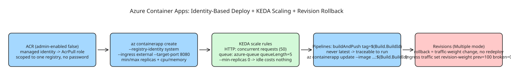

# How to Deploy Cloud-Native Apps with Azure Container Apps (Managed Identity, KEDA Scaling, Revisions)

Azure Container Apps sits in a specific gap: more managed than AKS (no nodes to patch, no control plane to operate), but built on the same primitives Kubernetes users know — **KEDA** for event-driven autoscaling, Dapr for service-to-service patterns, and standard container images. Three terms frame the build:

- **Container Apps Environment** — the boundary a set of apps share (networking, logging, Dapr config). Apps in one environment talk by name; different environments are network-isolated by default. Roughly "namespace + shared networking" without running the cluster.
- **Revision** — every deployment creates a new immutable revision. Single-revision mode cuts traffic entirely to the newest; multiple-revision mode runs several simultaneously with split traffic — what makes canary rollouts and instant rollback possible without redeploying.
- **Scale rule** — KEDA-based conditions: an HTTP rule counts concurrent requests, a queue rule counts waiting messages. Scale on the signal that reflects real demand, not a CPU proxy.

## Step 1 — ACR with managed identity (not a password)

```bash
az acr create \
  --resource-group rg-containerapps \
  --name acrcontainerappsdemo \
  --sku Standard \
  --admin-enabled false   # deliberate: no shared username/password for the whole registry
```

Container Apps authenticates with a **system-assigned managed identity** granted exactly one role scoped to exactly one registry — nothing else, and no credential anywhere to rotate or leak:

```bash
az containerapp identity assign \
  --resource-group rg-containerapps --name my-containerapp --system-assigned

az role assignment create \
  --assignee "$(az containerapp identity show --resource-group rg-containerapps --name my-containerapp --query principalId -o tsv)" \
  --role AcrPull \
  --scope "$(az acr show --resource-group rg-containerapps --name acrcontainerappsdemo --query id -o tsv)"

az containerapp registry set \
  --resource-group rg-containerapps --name my-containerapp \
  --server acrcontainerappsdemo.azurecr.io --identity system
```

## Step 2 — Create the Container App

```bash
az containerapp env create \
  --resource-group rg-containerapps --name env-containerapps-prod --location eastus

az containerapp create \
  --resource-group rg-containerapps --name my-containerapp \
  --environment env-containerapps-prod \
  --image acrcontainerappsdemo.azurecr.io/my-app:v1.0 \
  --registry-server acrcontainerappsdemo.azurecr.io --registry-identity system \
  --ingress external --target-port 8080 \
  --cpu 0.5 --memory 1.0Gi \
  --min-replicas 1 --max-replicas 10
```

`--ingress external` exposes the app through Container Apps' built-in load balancer + TLS termination; use `internal` for backend services other apps in the same environment should reach but the public internet shouldn't.

## Step 3 — Autoscaling: HTTP concurrency and queue depth

**HTTP-triggered** (concurrent requests per replica, not CPU):

```bash
az containerapp update \
  --resource-group rg-containerapps --name my-containerapp \
  --min-replicas 1 --max-replicas 10 \
  --scale-rule-name http-concurrency-rule \
  --scale-rule-type http \
  --scale-rule-http-concurrency 50
```

**Queue-triggered** (background worker scales on backlog; `--min-replicas 0` means the idle worker costs nothing):

```bash
az containerapp update \
  --resource-group rg-containerapps --name my-queue-worker \
  --min-replicas 0 --max-replicas 10 \
  --scale-rule-name queue-based-autoscaling \
  --scale-rule-type azure-queue \
  --scale-rule-metadata "accountName=mystorageaccount" "cloud=AzurePublicCloud" "queueLength=5" "queueName=work-items" \
  --scale-rule-auth "connection=queue-connection-secret"
```

## Step 4 — Continuous deployment with Azure Pipelines

```yaml
# azure-pipelines.yml
trigger:
  branches:
    include: [main]
pool:
  vmImage: ubuntu-latest
variables:
  acrName: acrcontainerappsdemo
  imageName: my-app
stages:
  - stage: BuildAndPush
    jobs:
      - job: Build
        steps:
          - task: Docker@2
            inputs:
              containerRegistry: 'acr-service-connection'
              repository: '$(imageName)'
              command: 'buildAndPush'
              Dockerfile: '**/Dockerfile'
              tags: '$(Build.BuildId)'   # never "latest" — every deployment traceable to a pipeline run
  - stage: Deploy
    dependsOn: BuildAndPush
    jobs:
      - job: DeployContainerApp
        steps:
          - task: AzureCLI@2
            inputs:
              azureSubscription: 'azure-service-connection'
              scriptType: bash
              scriptLocation: inlineScript
              inlineScript: |
                az containerapp update \
                  --resource-group rg-containerapps \
                  --name my-containerapp \
                  --image $(acrName).azurecr.io/$(imageName):$(Build.BuildId)
```

## Step 5 — Revisions: zero-downtime rollouts and instant rollback

Default is **single-revision mode** (new deployment fully replaces the old one). Switch to multiple-revision mode to control cutover explicitly:

```bash
az containerapp revision set-mode \
  --resource-group rg-containerapps --name my-containerapp --mode Multiple

# find current and previous revisions
az containerapp revision list \
  --resource-group rg-containerapps --name my-containerapp \
  --query "[].{Name:name, Active:properties.active, Traffic:properties.trafficWeight, Created:properties.createdTime}" -o table
```

Rollback is a **traffic-weight change**, not a redeploy — no rebuild, no new image:

```bash
az containerapp ingress traffic set \
  --resource-group rg-containerapps --name my-containerapp \
  --revision-weight my-containerapp--previous-revision=100 my-containerapp--broken-revision=0

# or copy a known-good older revision forward as a fresh one
az containerapp revision copy \
  --resource-group rg-containerapps --name my-containerapp \
  --from-revision my-containerapp--previous-revision
```

"Redeploy a previous known-good state" should be a single fast command available under incident pressure, not a rebuild-from-source scramble.

## Cost model note

Container Apps bills per **vCPU-second and GiB-second actually consumed**, not per provisioned instance-hour — a workload that scales to zero (like the queue worker above) costs nothing while idle. Meaningfully different from an always-on VM or AKS node pool that keeps running whether or not it's doing work.

## Diagram



## References

- [Deploying Cloud-Native Apps with Azure Container Apps (dev.to)](https://dev.to/rdgmh/deploying-cloud-native-apps-with-azure-container-apps-1bm9)
- [Full lab repo: azure-container-apps-cicd-lab](https://github.com/raphgm/azure-container-apps-cicd-lab)
