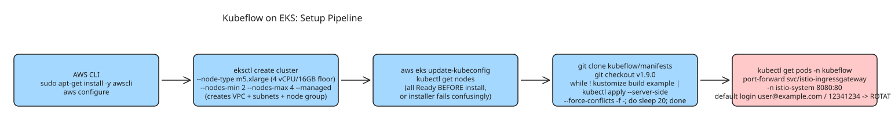

# How to Install and Set Up Kubeflow for ML on EKS

Kubeflow is a multi-component ML platform (Istio, Dex, cert-manager, Pipelines UI, Notebook controller, KServe) installed via Kustomize overlays — **not** a single Helm chart. This note walks through the real shape of getting it running on an AWS EKS cluster, including the gotchas that make setup take longer than one `aws eks create-cluster` call suggests.

## Step 1 — Set up AWS CLI

```bash
sudo apt-get update && sudo apt-get install -y awscli
aws configure   # Access Key ID, Secret Access Key, default region, output format
```

## Step 2 — Create the EKS cluster with eksctl

The raw `aws eks create-cluster` only works if you already have a VPC, subnets, and an EKS service role with the right trust policy. The faster path is **eksctl**, which creates the cluster, VPC, subnets, and a managed node group in one command:

```bash
eksctl create cluster \
  --name kubeflow-eks \
  --region us-east-1 \
  --nodegroup-name ml-nodes \
  --node-type m5.xlarge \
  --nodes 2 \
  --nodes-min 2 \
  --nodes-max 4 \
  --managed
```

`m5.xlarge` (4 vCPU, 16 GB RAM) is a reasonable **floor** — Kubeflow's control-plane components are memory-hungry even before any training job runs. Expect 15–20 minutes; eksctl provisions real VPC/subnet/IAM resources underneath.

Point kubectl at the cluster and verify nodes:

```bash
aws eks update-kubeconfig --name kubeflow-eks --region us-east-1
kubectl get nodes
```

All node-group instances must be `Ready` before continuing — Kubeflow's installer fails in confusing ways if nodes aren't ready yet.

## Step 3 — Install Kubeflow from the manifests repo

Kubeflow ships as Kustomize overlays in [kubeflow/manifests](https://github.com/kubeflow/manifests). Clone and check out a release tag matching your cluster's Kubernetes version:

```bash
git clone https://github.com/kubeflow/manifests.git
cd manifests
git checkout v1.9.0
```

Components have interdependencies that `kubectl apply -k` alone can't always resolve on the first pass (a CRD from one component may not exist yet when another references it). The project's documented workaround is to **retry in a loop** until every resource is created:

```bash
while ! kustomize build example | kubectl apply --server-side --force-conflicts -f -; do
  echo "Retrying to apply resources"
  sleep 20
done
```

This takes several passes and minutes — expected, not a sign of breakage, as long as errors are about missing CRDs rather than something else.

## Step 4 — Verify the install

```bash
kubectl get pods -n kubeflow   # every pod should reach Running
```

Reach the dashboard by port-forwarding the Istio ingress gateway (don't expose it publicly on a fresh cluster):

```bash
kubectl port-forward svc/istio-ingressgateway -n istio-system 8080:80
# open http://localhost:8080
```

Default login is `user@example.com` / `12341234` — treat it as a placeholder to **rotate immediately** on anything beyond a throwaway lab.

## Gotchas checklist

- Nodes not `Ready` before install → confusing installer failures.
- Single-pass `kubectl apply -k` → missing-CRD errors; use the retry loop with `--server-side --force-conflicts`.
- Under-provisioned nodes (below ~m5.xlarge) → control-plane components starve for memory.
- Default credentials left in place → security hole on any non-lab cluster.

## Diagram



## References

- [Install and set up Kubeflow for ML on EKS (dev.to)](https://dev.to/rdgmh/install-and-set-up-kubeflow-for-ml-on-eks-4cgm)
- [kubeflow/manifests repository](https://github.com/kubeflow/manifests)
