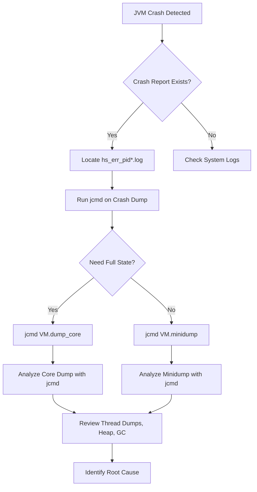

# How to Analyze JVM Crashes with jcmd (JEP 528)

## Summary

JEP 528 extends `jcmd` — the standard tool for monitoring and troubleshooting live HotSpot JVMs — with core dump and minidump generation capabilities for **crashed JVMs**. This howto explains how to use `jcmd` for post-mortem crash analysis, creating a consistent troubleshooting workflow across both live and crashed JVM environments.

## Why This Matters

Before JEP 528, diagnosing a crashed JVM required separate tools and workflows (e.g., `gdb`, `coredumpctl`, or platform-specific dump utilities). Now `jcmd` unifies the experience:

- **Same tool** for live diagnostics and post-mortem analysis
- **Consistent commands** regardless of JVM state (running or crashed)
- **Core dumps and minidumps** generated directly through `jcmd`
- **Reduced friction** — no context switching between `jcmd` and external debuggers

## JVM Crash Analysis Workflow



### Excalidraw Diagram Placeholder

> [!NOTE] Excalidraw Diagram
> Replace this block with an embedded Excalidraw diagram showing the JVM crash analysis workflow:
> - JVM crash detection → crash report generation
> - jcmd invocation on crash artifacts
> - Branch: full core dump vs. minidump
> - Analysis of thread state, heap, GC logs
> - Root cause identification
>
> Excalidraw embed:
> ```
> [excalidraw://jvm-crash-analysis-workflow]
> ```

## How to Use jcmd for Post-Mortem Analysis

### Prerequisites

- JDK with JEP 528 support (JDK 24+)
- Access to the crash dump or minidump file
- The JVM process may or may not still be running

### Step 1: Identify the JVM Process or Crash Artifact

```bash
# List all JVM processes (live and crashed)
jcmd

# Find the specific PID from crash reports
ls /path/to/hs_err_pid*.log
```

### Step 2: Generate a Minidump for Quick Diagnostics

Minidumps are lightweight and fast to generate. Use them for initial triage:

```bash
# Generate a minidump for the crashed JVM
jcmd <pid> VM.minidump

# Specify output path for the minidump
jcmd <pid> VM.minidump filename=/tmp/minidump.hprof
```

**What a minidump includes:**
- Thread states and stack traces
- Basic JVM configuration
- Lock information
- Signal handler state

**What a minidump does NOT include:**
- Full heap contents
- Detailed object graphs
- Complete GC state

### Step 3: Generate a Full Core Dump for Deep Analysis

When a minidump isn't sufficient, generate a full core dump:

```bash
# Generate a full core dump
jcmd <pid> VM.dump_core

# Specify output path
jcmd <pid> VM.dump_core filename=/tmp/core.dump
```

**What a core dump includes:**
- Everything in a minidump, plus
- Complete heap memory
- All loaded classes and their bytecode
- Full GC state and statistics
- Native memory tracking data

### Step 4: Analyze the Dump with jcmd Commands

After generating a dump, use standard `jcmd` diagnostics:

```bash
# Get thread dump from crash state
jcmd <pid> Thread.print

# Get GC information
jcmd <pid> GC.heap_info

# Get class loader statistics
jcmd <pid> GC.class_histogram

# Get VM system properties
jcmd <pid> VM.system_properties

# Get VM flags
jcmd <pid> VM.flags

# Get compiler statistics
jcmd <pid> Compiler.stats
```

### Step 5: Cross-Reference with Crash Report

Combine `jcmd` output with the `hs_err_pid*.log` crash report:

```bash
# Key sections in crash report to cross-reference:
# - Stack trace at crash point
# - Signal information (SIGSEGV, SIGBUS, etc.)
# - Native libraries loaded
# - JVM arguments and flags
# - GC configuration and recent GC events
# - Thread states at crash time
```

## Practical Troubleshooting Scenarios

### Scenario 1: OutOfMemoryError Crash

```bash
# 1. Generate minidump for quick check
jcmd <pid> VM.minidump

# 2. Check heap usage
jcmd <pid> GC.heap_info

# 3. Check class histogram for memory hogs
jcmd <pid> GC.class_histogram

# 4. If needed, full core dump for deep heap analysis
jcmd <pid> VM.dump_core
```

### Scenario 2: Native Code Crash (SIGSEGV)

```bash
# 1. Generate core dump (need full memory for native stack)
jcmd <pid> VM.dump_core

# 2. Check loaded native libraries
jcmd <pid> VM.system_properties

# 3. Review thread dumps for native frames
jcmd <pid> Thread.print
```

### Scenario 3: Deadlock Detection

```bash
# 1. Thread dump shows blocked threads
jcmd <pid> Thread.print

# 2. VM summary for lock information
jcmd <pid> VM.info
```

## Tips and Best Practices

1. **Start with minidump** — faster and smaller, sufficient for most initial triage
2. **Core dumps are large** — ensure adequate disk space before generating
3. **Combine with hs_err_pid logs** — `jcmd` output + crash report = complete picture
4. **Use consistent commands** — same `jcmd` commands work for live and crashed JVMs
5. **Automate dump generation** — consider scripting `jcmd` for crash detection pipelines

## References

- [JEP 528: jcmd Core Dump and Minidump Support](https://inside.java/2026/05/16/javaone-jcmd-jvm-analysis/) — Original article by Fairoz Matte, Inside.Java, May 16, 2026
- [JEP 528 Specification](https://openjdk.org/jeps/528) — Official JEP document
- [jcmd Documentation](https://docs.oracle.com/en/java/javase/24/tools/jcmd.html) — Oracle jcmd reference
